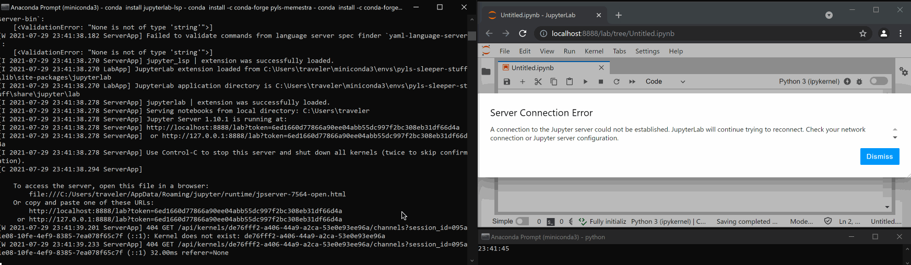

# Windows with Pyls(p) and Jupyterlab-lsp: subprocesses hang until one interacts with notebook
We are writing a Jupyterlab-lsp plugin, similar in form to [pyls-memestra](https://github.com/QuantStack/pyls-memestra), except instead of analyzing code with a Python library, we shell out to an external executable through the `subprocess` module.

We run into a strange issue on Windows (not on Linux or macOS) where, external processes spawned by the Jupyterlab-lsp plugin *hang* without executing, until the user interacts with the notebook, e.g., clicking on a different cell or editing or saving the notebook.

This causes *other* Jupyterlab-lsp plugins to not update, until the hanging plugin eventually completes.

## Reproduction
To reproduce this issue, this repo contains a very simple Jupyterlab-lsp plugin that [spawns a shell call](./pyls_sleeper/plugin.py) to `python` to run a simple Python script `sleeper.py` that [sleeps for three seconds](./pyls_sleeper/ext/sleeper.py). The plugin prints the PID of the spawned process when it starts, and when it ends.

In Linux/macOS, which work correctly, each spawned PID ends three seconds after it begins.

However in Windows, immediately upon Jupyterlab opening the notebook, the `python` process is spawned but fails to finish, and data from other Jupyterlab-lsp plugins like pyls-memestra doesn't show in the browser. If I click on another cell, then the process reliably finishes three seconds after my click.

As I edit the notebook, the plugin spawns processes and they complete—because I'm interacting with the notebook by typing. If I stop typing and wait, the most recently spawned process will hang, not finishing for seconds or minutes, until I interact with the notebook.



N.B. If this plugin, instead of shelling out to an external process, simply sleeps itself for three seconds (`CALL_EXTERNAL = False` in the [plugin]((./pyls_sleeper/plugin.py))), this problem goes away: the plugin starts, takes three seconds to complete, and returns.

This suggests that the threading infrastructure used by pyls(p) is spawning the process via `subprocess` but is pausing the thread until it's "poked" by interacting with the notebook—on Windows at least. On Linux and macOS, the spawned process seems to run fine independently.

N.B. This issue happens on the original [python-language-server](https://github.com/palantir/python-language-server) as well as its new community-developed fork [python-lsp-server](https://github.com/python-lsp/python-lsp-server).

## Steps to reproduce
I create a fresh conda environment in Windows and install pyls-memestra and other requirements:
```
conda create -n pylaguageserver-sleeper
conda activate pylaguageserver-sleeper
conda install -c conda-forge pyls-memestra jupyterlab-lsp nodejs
```

Then I pip-install this repo:
```
pip install c:\path\to\pyls_sleeper
```
and start the Jupyter server:
```
jupyter lab --no-browser
```

The notebook illustrated above has the following demo content to exercise memestra and pycodestyle plugins:
```py
import deprecated
@deprecated.deprecated('bad func')
def foo():
    pass
foo()
```

## Windows Python Popen semi-workarounds
If we invoke `Popen` with the following keywords:
```py
proc = subprocess.Popen(["python", sleeper_file], stdout=None, stderr=None, creationflags=subprocess.DETACHED_PROCESS)
```
this does not hang in Windows. Per the [`Popen` docs](https://docs.python.org/3/library/subprocess.html#subprocess.Popen), `stdout=stderr=None` means:
> With the default settings of None, no redirection will occur; the child’s file handles will be inherited from the parent

We *also* need to detach the process for this to avoid hanging. With both these requirements, this pyls plugin completes after three seconds, allowing the frontend to display all pyls plugins' analysis.

The downside to this is, of course, we cannot consume the spawned subprocess' `stdout`. This is the issue documented in this [Stack Overflow](https://stackoverflow.com/questions/16523877/subprocess-communicate-hangs-on-windows-8-if-parent-process-creates-some-child#comment23794470_16542268) comment, and also in this [Python bug report](https://bugs.python.org/issue1227748) which argues that the Popen docstring is semantically incorrect for Windows, and that default behavior in Windows is *different* than on Unix.

However, it remains unclear to me how to get Unix-like behavior (i.e., no hanging) on Windows with this set of keywords to `Popen`.

We *could* work around not having stdout by passing a temporary file into the shelled subprocess as a command-line argument and having it write to that file instead of printing to stdout. However, a more generic solution would be nice.

## Process debugger information
Opening the spawned process' PID in Windows [Process Explorer](https://docs.microsoft.com/en-us/sysinternals/downloads/process-explorer) shows that it's stuck at the same function (`ntdll.dll!ZwQueryInformationFile`), with the following stack:
```
ntdll.dll!ZwQueryInformationFile+0x14
KERNELBASE.dll!SetFilePointerEx+0xba
ucrtbase.dll!close+0x2a5
ucrtbase.dll!fgetpos+0x19c
python39.dll!PyTraceMalloc_GetTraceback+0xaa50
python39.dll!PyComplex_AsCComplex+0x373d
python39.dll!PyBytesWriter_WriteBytes+0x109
python39.dll!PyObject_VectorcallMethod+0x79
python39.dll!PyTraceMalloc_GetTraceback+0x13109
python39.dll!PyTraceMalloc_GetTraceback+0x1341d
python39.dll!PyTraceMalloc_GetTraceback+0x17c98
python39.dll!PyType_Name+0x164b
python39.dll!PyObject_MakeTpCall+0x147
python39.dll!PyObject_Call_Prepend+0x205
python39.dll!PyObject_CallFunction_SizeT+0x34
python39.dll!PyTraceMalloc_GetTraceback+0x274ff
python39.dll!PyTraceMalloc_GetTraceback+0x27ed0
python39.dll!PyCFunction_GetFlags+0xb2b
python39.dll!PyBytesWriter_WriteBytes+0x109
python39.dll!PyObject_Call_Prepend+0x205
python39.dll!PyObject_CallMethodId+0xa0
python39.dll!Py_EndInterpreter+0x586
python39.dll!Py_EndInterpreter+0xe23
python39.dll!Py_PreInitializeFromConfig+0xa78
python39.dll!Py_PreInitializeFromConfig+0xde7
python39.dll!Py_InitializeFromConfig+0xec
python39.dll!PyObject_GC_IsFinalized+0x880f
python39.dll!Py_RunMain+0xbf1
python39.dll!Py_Main+0x26
python.exe!OPENSSL_Applink+0x398
KERNEL32.DLL!BaseThreadInitThunk+0x14
ntdll.dll!RtlUserThreadStart+0x21
```
